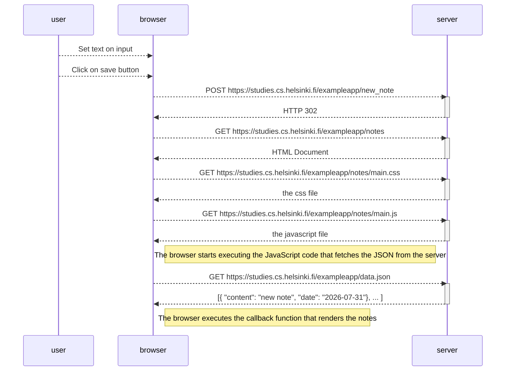

```mermaid
sequenceDiagram
    participant user
    participant browser
    participant server

    user-->>browser: Set text on input
    user-->>browser: Click on save button
    
    browser-->>server: POST https://studies.cs.helsinki.fi/exampleapp/new_note
    activate server
    server-->>browser: HTTP 302
    deactivate server

    browser-->>server: GET https://studies.cs.helsinki.fi/exampleapp/notes
    activate server
    server-->>browser: HTML Document
    deactivate server

    browser-->>server: GET https://studies.cs.helsinki.fi/exampleapp/notes/main.css
    activate server
    server-->>browser: the css file
    deactivate server

    browser-->>server: GET https://studies.cs.helsinki.fi/exampleapp/notes/main.js
    activate server
    server-->>browser: the javascript file
    deactivate server

    Note right of browser: The browser starts executing the JavaScript code that fetches the JSON from the server

    browser-->>server: GET https://studies.cs.helsinki.fi/exampleapp/data.json
    activate server
    server-->>browser: [{ "content": "new note", "date": "2026-07-31"}, ... ]
    deactivate server

    Note right of browser: The browser executes the callback function that renders the notes
```