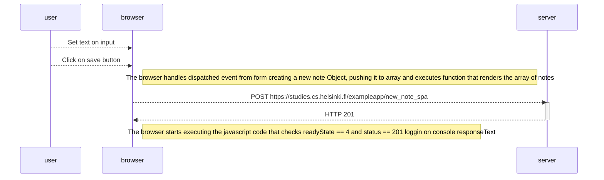

```mermaid
sequenceDiagram
    participant user
    participant browser
    participant server

    user-->>browser: Set text on input
    user-->>browser: Click on save button
    
    Note right of browser: The browser handles dispatched event from form creating a new note Object, pushing it to array and executes function that renders the array of notes

    browser-->>server: POST https://studies.cs.helsinki.fi/exampleapp/new_note_spa
    activate server
    server-->>browser: HTTP 201
    deactivate server

    Note right of browser: The browser starts executing the javascript code that checks readyState == 4 and status == 201 loggin on console responseText

```